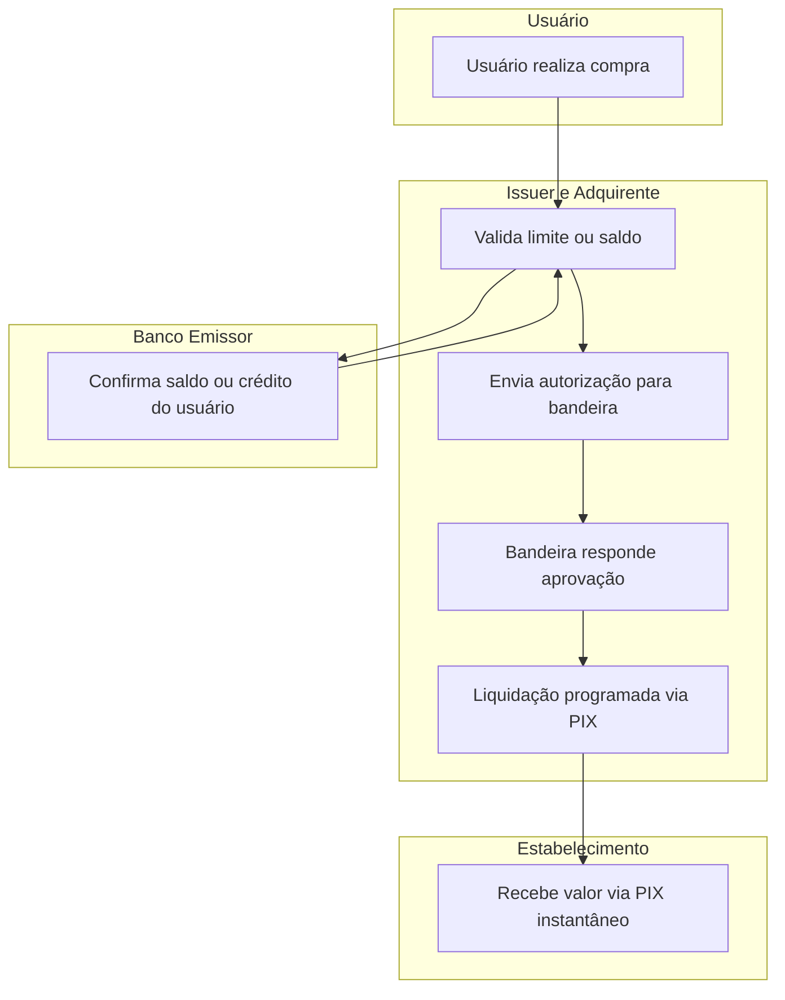
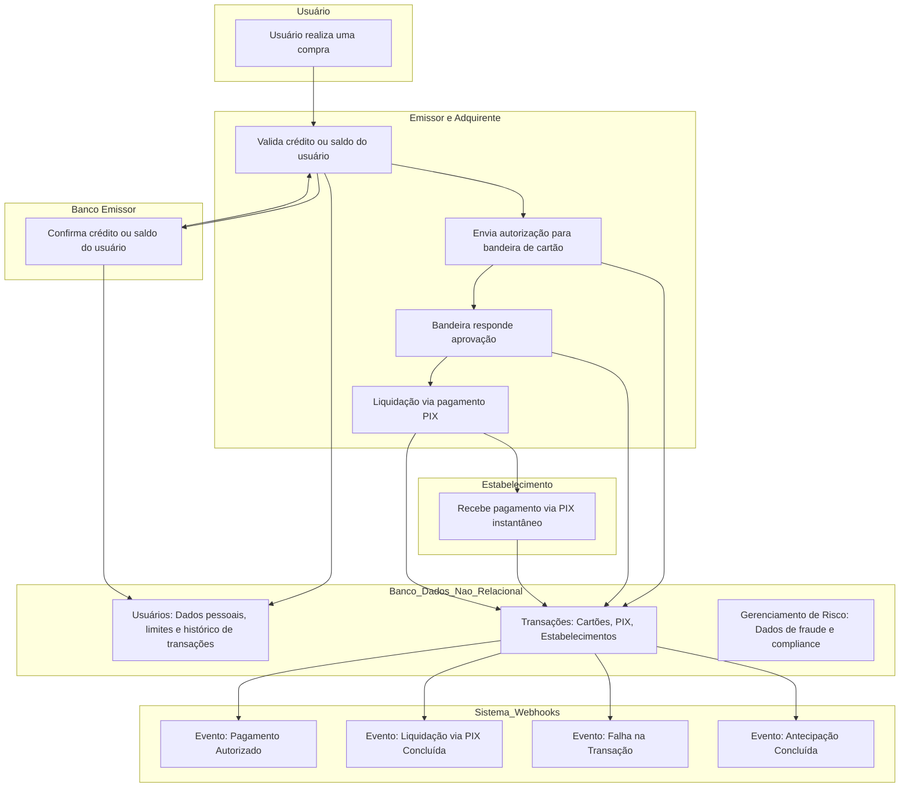

| Status          | Proposed                                                    |
|-----------------|-------------------------------------------------------------|
| **RFC**         | RFC: Integração de Cartão com Liquidação via PIX pela Woovi |
| **Autor**       | [Iago José Silva Ferreira](https://github.com/iagxferreira) |
| **Sponsor**     | Woovi                                                       |
| **Atualização** | 2025-04-26                                                  |

# RFC: Integração de Cartão com Liquidação via PIX pela Woovi
## 1. Contexto
A Woovi deseja ampliar seu ecossistema financeiro, emitindo cartões de crédito e débito associados a contas existentes na plataforma. Além disso, pretende oferecer liquidação instantânea para estabelecimentos comerciais através do sistema de pagamentos instantâneos (PIX).

Tradicionalmente, transações de cartão passam pela Bandeira, Adquirente, e Instituições Financeiras, com liquidação em prazos como D+1 ou D+30. Ao integrar o PIX no fluxo de liquidação, podemos oferecer liquidação imediata, reduzindo o tempo de recebimento do estabelecimento e gerando novas oportunidades de receita via taxas diferenciadas.

## 2. Problema
Atualmente, não existe integração nativa que una **cartão** e **PIX** no mesmo fluxo, respeitando as obrigações operacionais das bandeiras (como Mastercard, Visa) e o compliance regulatório do sistema bancário brasileiro.

Desafios identificados:
- Validação com as Bandeiras para permitir liquidação via PIX.
- Definição clara de limites e fontes de crédito (saldo pré-pago ou crédito outorgado).
- Coleta de dados bancários do recebedor (domicílio bancário).
- Gestão de risco, compliance e inadimplência.
- Estrutura de taxas adequada ao novo fluxo.

## 3. Objetivo
Implementar a emissão de cartões pela Woovi e viabilizar pagamentos via cartão que possam ser liquidados via PIX, criando um fluxo financeiro ágil, transparente e seguro para clientes e estabelecimentos.

O projeto visa:
- Emitir cartões Woovi (crédito e/ou débito) com bandeira homologada.
- Processar pagamentos de cartão via adquirente própria ou parceira.
- Permitir a liquidação instantânea via PIX para o domicílio bancário do estabelecimento.
- Gerar diferenciais de serviço através de antecipação instantânea e taxas competitivas.

## 4. Escopo
**Inclusões:**
- Integração com bandeiras (Visa, Mastercard, etc.).
- APIs de pagamento (autorização, captura, liquidação, estorno).
- APIs de gerenciamento de cartões (emissão, bloqueio, reemissão).
- API interna de liquidação PIX após autorização do pagamento.
- Sistema de controle de limites (pré-pago e crédito).

**Exclusões:**
- Gestão de inadimplência além do fluxo padrão de bandeiras.
- Financiamento de crédito ao consumidor final (no primeiro momento).
- Parcelamento de compras no modelo emissor.

## 5. Informações Necessárias
Para viabilizar o fluxo, serão necessárias as seguintes informações dos usuários:

| Campo                     | Obrigatório | Uso                                |
|:--------------------------|:------------|:----------------------------------|
| Nome completo             | Sim         | Emissão de cartão e KYC           |
| CPF                       | Sim         | Emissão de cartão e compliance    |
| Data de nascimento        | Sim         | Validação regulatória             |
| Endereço completo         | Sim         | Exigência da bandeira             |
| Banco emissor             | Sim         | Controle de origem dos fundos    |
| Agência e conta bancária  | Sim         | Liquidação via PIX                |
| Limite disponível         | Sim         | Autorização de transações         |
| Histórico de transações   | Opcional     | Cálculo de limite futuro          |
| Telefone e Email          | Sim         | Comunicação e autenticação        |
| Domicílio bancário do recebedor | Sim   | Liquidação via PIX                |

## 6. Primeiros Fluxos (Alto Nível)


## 7. Fluxo de Integrações

Para permitir a operação de cartões com liquidação via PIX, serão necessárias integrações em múltiplos níveis:

| Sistema                         | Função                                    | Descrição Técnica |
|:---------------------------------|:------------------------------------------|:------------------|
| Bandeira (Visa, Mastercard)      | Autorização de transações e compliance    | Comunicação via APIs de transação, autorização, captura, e estorno conforme PCI-DSS. |
| Banco Emissor                    | Validação de saldo e crédito              | Integração via protocolo ISO 8583 ou API proprietária. |
| Sistema PIX (Banco Central)      | Liquidação dos valores                   | Uso de APIs de iniciação de pagamento instantâneo (SPI ou API Open Finance). |
| Sistema de Gestão de Limites     | Controle de saldo e/ou crédito            | Sistema próprio ou terceirizado que calcula limites e gerencia bloqueios. |
| Motor de Fraude e Compliance     | Prevenção de riscos                      | Sistema de validação antifraude em tempo real (KYC, AML, validações instantâneas). |
| API Pública de Pagamentos        | Interface com Estabelecimentos           | Endpoints de processamento de pagamentos, status, e relatórios. |
| Plataforma de Antecipação        | Liquidação antecipada opcional           | Sistema de simulação e contratação de antecipação de recebíveis. |

## 8. Regras Técnicas

### 9.1. Sobre a autorização da transação
- Sempre que um pagamento for iniciado, a Woovi deve:
  - Validar limite disponível (crédito ou saldo).
  - Solicitar autorização à Bandeira (Visa/Mastercard).
  - Caso autorizado, iniciar o fluxo de liquidação via PIX.

**Nota:** A aprovação da Bandeira é necessária mesmo para liquidação instantânea via PIX.

### 9.2. Sobre a liquidação via PIX
- Após a autorização da compra:
  - A Woovi gera uma ordem de pagamento PIX para o domicílio bancário do estabelecimento.
  - O pagamento é feito em até 5 segundos, respeitando as regras do SPI do Banco Central.
  - Em caso de falha na transferência PIX:
    - Realizar uma tentativa de fallback (reenvio).
    - Se persistir, abrir alerta de reconciliação manual.

### 9.3. Sobre limites e saldo
- Para cartões de **débito**:
  - Usar saldo disponível na conta Woovi.
- Para cartões de **crédito**:
  - Gerar limite com base em análise de transações e scoring interno.
  - Possibilitar ajuste automático de limite conforme comportamento do cliente.

### 9.4. Sobre antecipação instantânea
- Estabelecimentos poderão optar por receber o valor antecipadamente (menos a taxa).
- No modelo instantâneo (com PIX), o desconto da taxa será aplicado imediatamente no momento da liquidação.
- A antecipação poderá ser configurada via API ou painel administrativo.

### 9.5. Sobre taxas e precificação
- Cada transação poderá ter:
  - **Taxa de cartão:** cobrada na autorização da bandeira.
  - **Taxa de liquidação instantânea:** adicional por uso do PIX.
  - **Taxa de antecipação:** caso optem por recebimento antecipado.

Exemplo:

| Item                          | Percentual Aplicado |
|:------------------------------|:--------------------|
| Taxa padrão de cartão crédito | 2,5%                |
| Taxa de liquidação via PIX    | 0,2%                |
| Taxa de antecipação (opcional) | 1,0%                |

### 9.6. Sobre tipos de transação
- Todas as transações receberão um campo adicional de **tipo de pagamento**:
  - `CARD_DEBIT`
  - `CARD_CREDIT`
  - `PIX_SETTLED_CARD_DEBIT`
  - `PIX_SETTLED_CARD_CREDIT`

Isso facilita auditorias, reconciliação contábil e relatórios internos.

## 9. Considerações Legais e Regulatórias

- Devemos seguir todas as exigências PCI-DSS para processamento e armazenamento de dados de cartão.
- Integrações com o PIX devem obedecer às normas do Banco Central do Brasil.
- Todo processamento de dados pessoais deve estar em conformidade com a LGPD.

## 10. Exemplo de Fluxo Completo

### 11.1. Cenário: Pagamento com Cartão de Crédito, Liquidação via PIX

1. **Início da Compra**
- Cliente inicia pagamento com o cartão Woovi (bandeira Mastercard).

2. **Validação Inicial**
- Woovi verifica:
  - Se o cartão está ativo.
  - Se o limite de crédito é suficiente para a transação.

3. **Autorização da Transação**
- Woovi envia requisição para a Bandeira solicitando autorização.
- Bandeira comunica o Banco Emissor.
- Banco Emissor aprova a transação.

4. **Confirmação da Autorização**
- Bandeira retorna "Autorizado" para a Woovi.
- Woovi confirma a transação para o Estabelecimento.

5. **Liquidação via PIX**
- Woovi gera um pagamento PIX no valor líquido (já descontadas as taxas, se aplicável).
- Woovi inicia o processo de transferência via SPI (Sistema de Pagamentos Instantâneos).
- Domicílio bancário do estabelecimento recebe o valor em poucos segundos.

6. **Registro da Transação**
- A transação é registrada no sistema da Woovi como:
  - Tipo: `PIX_SETTLED_CARD_CREDIT`
  - Status: `Completed`
  - Timestamps de autorização e de liquidação.

7. **Ciclo de Repasse**
- Após X dias, Banco Emissor paga a Bandeira o valor da transação (fluxo tradicional de cartões).
- Bandeira repassa o valor à Woovi, que já adiantou o pagamento ao estabelecimento via PIX.

8. **Controle de Risco**
- Se o cliente não pagar a fatura:
  - O risco é da Woovi, que deve considerar isso no cálculo de taxas e limites.

### 11.2. Fluxograma Resumido

```plaintext
Cliente → Woovi (cartão) → Bandeira → Banco Emissor
   ↓                        ↑
Liquidação PIX ←→ Estabelecimento (Domicílio Bancário)
```

## 11. Eventos e Webhooks

Durante o fluxo, poderão ser disparados eventos via webhook para os sistemas dos estabelecimentos:

| Evento                      | Descrição                                    |
|:-----------------------------|:--------------------------------------------|
| `payment_authorized`         | Pagamento autorizado pela bandeira.          |
| `payment_settled_pix`        | Liquidação concluída via PIX.                |
| `payment_failed`             | Falha na autorização ou liquidação.          |
| `payment_anticipation_done`  | Recebimento de antecipação concluído.         |
| `payment_chargeback`         | Notificação de disputa ou estorno.            |

- Os webhooks devem conter:
  - ID da transação.
  - Status atual.
  - Valor bruto e líquido.
  - Timestamps relevantes.

---

## 12. Considerações de Segurança

- As chamadas de API e webhooks devem ser autenticadas via OAuth2 ou HMAC.
- Os dados sensíveis (como PAN do cartão) nunca devem transitar em payloads sem tokenização ou criptografia.
- Todas as integrações com bandeiras e bancos devem seguir protocolos seguros (TLS 1.2+).

## 13. Integração e Fluxo de Transações

Processo de Integração

Contato com Bandeiras:
- Entrar em contato com as principais bandeiras (Visa, Mastercard, Elo, etc.) para apresentar a proposta de operação de cartões baseados em saldo PIX.
- Entender as restrições técnicas e comerciais para emissão de cartões atrelados a saldo instantâneo.
- Avaliar possíveis parcerias ou necessidade de ajustes no modelo operacional.

Infraestrutura:
- Desenvolvimento de APIs próprias para gestão de cartões (emissão, cancelamento, bloqueio, reemissão).
- API de transações para intermediar comunicação entre adquirente, bandeira e banco emissor.
- Controle de limites dinâmicos baseados no saldo da conta do usuário ou crédito interno.

Autorização de Transações:
No momento da compra, a autorização deve:
- Verificar o saldo da conta ou limite interno.
- Bloquear o valor temporariamente, aguardando a compensação da transação.
- Atualizar o saldo em caso de sucesso ou liberar o valor se a transação falhar.

## 14. Estrutura de Dados - Coleções

Documents representing system users (either clients or merchants).
```json
{
  "_id": ObjectId("..."),
  "full_name": "User Name",
  "cpf": "123.456.789-00",
  "birth_date": "1990-01-01",
  "full_address": "Street X, 123",
  "issuing_bank": "Bank A",
  "agency": "1234",
  "account_number": "123456789",
  "available_balance": 1000.00,
  "transaction_history": [
    {
      "date": "2025-04-26",
      "amount": 100.00,
      "type": "PIX_SETTLED_CARD_CREDIT",
      "status": "Completed"
    }
  ],
  "phone": "(31) 91234-5678",
  "email": "user@domain.com",
  "receiving_bank_account": "Bank X, Agency 4321"
}
```

2. Transactions Collection (Transacoes)

Documents representing each payment transaction, whether by card or PIX.
```json
{
"_id": ObjectId("..."),
"user_id": ObjectId("..."),
"gross_amount": 120.00,
"net_amount": 110.00,
"card_fee": 2.5,
"pix_fee": 0.2,
"payment_type": "PIX_SETTLED_CARD_CREDIT",
"status": "Completed",
"authorization_timestamp": "2025-04-26T10:00:00Z",
"settlement_timestamp": "2025-04-26T10:05:00Z",
"event": "payment_settled_pix"
}
```

3. Merchants
- Documents representing the merchants receiving payments via PIX.
```json
{
  "_id": ObjectId("..."),
  "merchant_name": "Merchant X",
  "cpf_cnpj": "00.000.000/0001-00",
  "phone": "(31) 98765-4321",
  "email": "merchant@domain.com",
  "bankAccount": ObjectId("..."),
}
```
4. Banks
```json
{
  "_id": ObjectId("..."),
  "bank": "Bank Y",
  "agency": "5432",
  "account_number": "987654321"
}
```


4. Advance Transactions Collection
- Documents representing payment anticipation transactions for merchants.
```json
{
  "_id": ObjectId("..."),
  "transaction_id": ObjectId("..."),
  "advanced_amount": 105.00,
  "anticipation_fee": 1.0,
  "status": "Completed",
  "anticipation_timestamp": "2025-04-26T10:10:00Z",
  "event": "payment_anticipation_done"
}
```

5. Credit Limits Collection
- Documents managing users' credit limits or available balances.
```json
{
  "_id": ObjectId("..."),
  "user_id": ObjectId("..."),
  "credit_limit": 1500.00,
  "available_balance": 1000.00,
  "type": "credit",  // Or "prepaid"
  "last_updated": "2025-04-26T09:00:00Z"
}
```

6. Events Collection
- Documents for managing events triggered, such as authorized, settled, or failed transactions.
```json
{
  "_id": ObjectId("..."),
  "transaction_id": ObjectId("..."),
  "event": "payment_authorized",
  "status": "Pending",
  "event_timestamp": "2025-04-26T10:00:00Z",
  "description": "Transaction authorized by the card network"
}
```



## 15. Fluxo completo

Usuários armazenam dados pessoais, histórico de transações e saldo disponível.

Transações incluem detalhes de pagamento como valor bruto/líquido, taxas e status.

Comerciantes representam entidades recebendo pagamentos via PIX.

Transações Antecipadas rastreiam o valor e taxa para quaisquer antecipações realizadas.

Limites de Crédito mantêm controle do saldo disponível e limites de crédito do usuário.

Eventos representam ações-chave no processo de pagamento, como autorização ou falha de pagamento.
